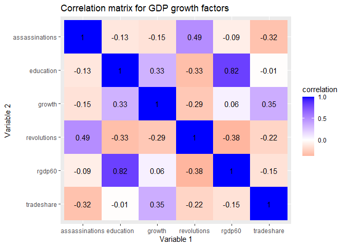
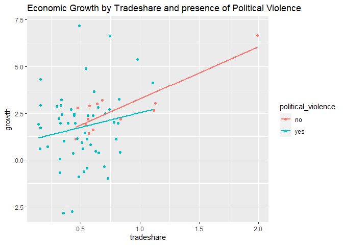
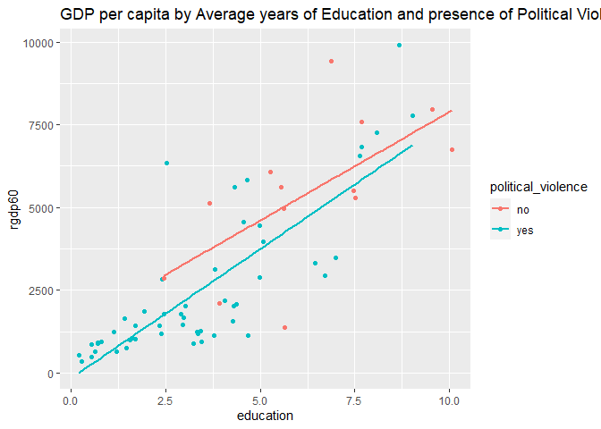
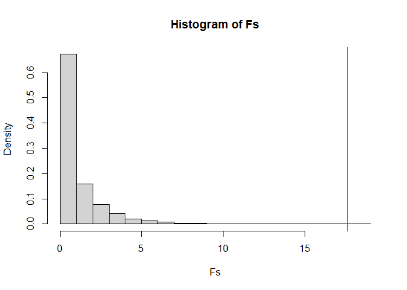
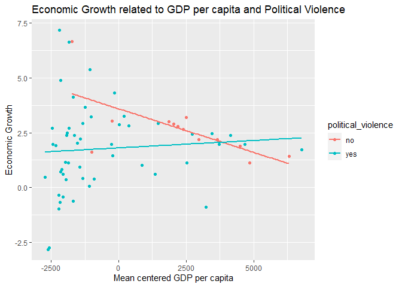
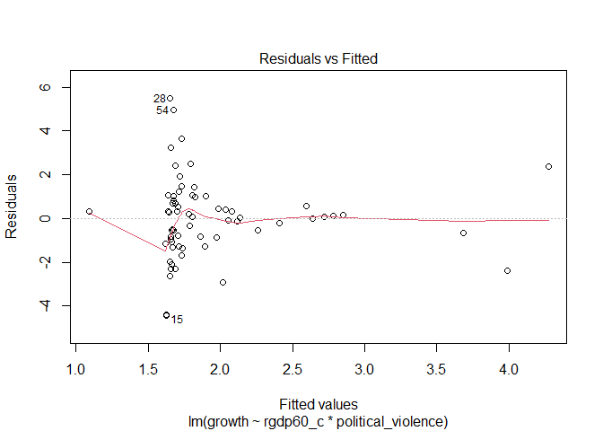
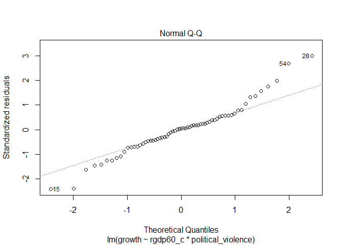
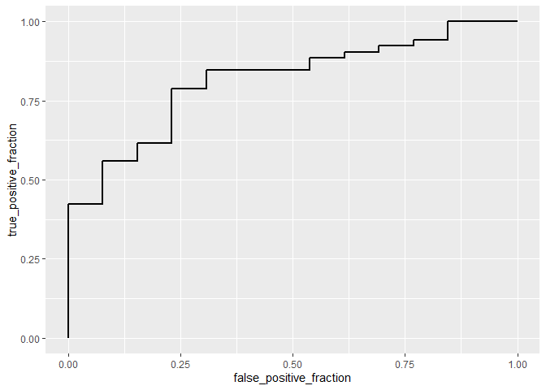

Report 2
================
Israel Vasquez iv3356
4/21/2021

## Data selected

The data selected were two separate datasets exploring determinants of
economic growth data found within the R-package “AER”. The variables
that will be used in this report are “growth” the average percentage
change in gdp from 1960-1995, “rgdp60” the gdp per capita in the year
1960 (in USD), “education” the average number of years of schooling
adult residents received, “tradeshare” the sum of exports and imports
divided by GDP, “revolutions” the average annual number of
revolutions/coups/insurrections from 1960-1995, and “assassinations” the
average annual number of political assassinations from 1960-1995 (in per
million population). I chose this data since I thought it would be
interesting to explore specifically how the effects of radical violence
such as assassinations and revolutions on GDP growth compared to the
effects of typical economic factors. The two datasets were found to be
already tidy and were joined using the following code.

``` r
library(tidyverse)
```

    ## -- Attaching packages --------------------------------------- tidyverse 1.3.0 --

    ## v ggplot2 3.3.3     v purrr   0.3.4
    ## v tibble  3.0.5     v dplyr   1.0.3
    ## v tidyr   1.1.2     v stringr 1.4.0
    ## v readr   1.4.0     v forcats 0.5.0

    ## -- Conflicts ------------------------------------------ tidyverse_conflicts() --
    ## x dplyr::filter() masks stats::filter()
    ## x dplyr::lag()    masks stats::lag()

``` r
library(readr)
GrowthDJ <- read_csv("C:/Users/israe/Documents/RStuff/GrowthDJ.csv")
```

    ## Warning: Missing column names filled in: 'X1' [1]

    ## 
    ## -- Column specification --------------------------------------------------------
    ## cols(
    ##   X1 = col_double(),
    ##   oil = col_character(),
    ##   inter = col_character(),
    ##   oecd = col_character(),
    ##   gdp60 = col_double(),
    ##   gdp85 = col_double(),
    ##   gdpgrowth = col_double(),
    ##   popgrowth = col_double(),
    ##   invest = col_double(),
    ##   school = col_double(),
    ##   literacy60 = col_double()
    ## )

``` r
growth <- read_csv("C:/Users/israe/Documents/RStuff/GrowthSW.csv")
```

    ## 
    ## -- Column specification --------------------------------------------------------
    ## cols(
    ##   X1 = col_double(),
    ##   country = col_character(),
    ##   growth = col_double(),
    ##   rgdp60 = col_double(),
    ##   tradeshare = col_double(),
    ##   education = col_double(),
    ##   revolutions = col_double(),
    ##   assassinations = col_double()
    ## )

``` r
data1 <- growth %>% left_join(GrowthDJ, by = 'X1')
```

## Further Data Manipulation and EDA

``` r
#add categorical variable
data1 <- data1 %>%
  mutate(political_violence= case_when(assassinations > 0 ~ 'yes',
                                       revolutions > 0 ~ 'yes',
                                       TRUE ~ 'no'))

#create separate dataframe of just numeric variables of interest
data1_num <- data1 %>%
  select(-X1) %>%
  column_to_rownames("country") %>%
  select(`growth`,rgdp60,tradeshare,education,revolutions,assassinations)

#cor matrix

cor(data1_num) %>%
  as.data.frame %>%
  rownames_to_column %>%
  pivot_longer(-1, names_to = "other_var", values_to = "correlation") %>%
  ggplot(aes(rowname, factor(other_var, levels = rev(levels(factor(other_var)))), fill=correlation)) +
  geom_tile() +
  scale_fill_gradient2(low="red",mid="white",high="blue") +
  geom_text(aes(label = round(correlation,2)), color = "black", size = 4) +
  labs(title = "Correlation matrix for GDP growth factors", x = "Variable 1", y = "Variable 2")
```

<!-- -->

``` r
#dummy coding catagorical variable
data1 <- data1 %>%
  as.data.frame() %>%
  mutate(y = ifelse(political_violence == 'yes',1,0))
```

Since there were no categorical variables within the dataset, I first
created a new categorical variable named “political\_violence” where
when there was an assassination or a revolution in a country, the
variable would read a value of “yes”, and if there were neither, it
would read a value of “no”. I then dummy coded this categorical variable
by mutating a new variable called “y” where 1 would indicate “yes” and 0
would indicate “no”. Next I created a separate data frame containing
only the numerical variables of interest to efficiently calculate
summary statistics and to create the correlation matrix later on. After
I created the correlation matrix for the numeric variables of interest,
I found that the biggest contributors (either positively or negatively)
to economic growth were tradeshare, and political violence. Another
discovery was that GDP per capita was heavily correlated to education. I
created two more scatterplots to better see the relationship between
these correlates.

``` r
#economic growth by tradeshare and the presence of political violence
ggplot(data = data1, aes(x = tradeshare, y = `growth`)) +
  geom_point(aes(color = political_violence)) +
  geom_smooth(method = 'lm', se = FALSE, aes(color = political_violence)) +
  labs(title = 'Economic Growth by Tradeshare and presence of Political Violence')
```

    ## `geom_smooth()` using formula 'y ~ x'

<!-- -->

``` r
#GDP per capita by Average years of Education and presence of Political Violence
ggplot(data = data1, aes(x = education, y = rgdp60)) +
  geom_point(aes(color = political_violence)) +
  geom_smooth(method = 'lm', se = FALSE, aes(color = political_violence)) +
  labs(title = 'GDP per capita by Average years of Education and presence of Political Violence')
```

    ## `geom_smooth()` using formula 'y ~ x'

<!-- -->

## MANOVA

``` r
#creating manova
manova1 <- manova(cbind(growth,rgdp60,tradeshare,education)~political_violence, data = data1)
summary(manova1)
```

    ##                    Df  Pillai approx F num Df den Df    Pr(>F)    
    ## political_violence  1 0.42736   11.194      4     60 7.534e-07 ***
    ## Residuals          63                                             
    ## ---
    ## Signif. codes:  0 '***' 0.001 '**' 0.01 '*' 0.05 '.' 0.1 ' ' 1

``` r
#follow up ANOVA to find which predictors differ significantly
summary.aov(manova1)
```

    ##  Response growth :
    ##                    Df  Sum Sq Mean Sq F value Pr(>F)
    ## political_violence  1   8.466  8.4662  2.4039  0.126
    ## Residuals          63 221.874  3.5218               
    ## 
    ##  Response rgdp60 :
    ##                    Df    Sum Sq  Mean Sq F value    Pr(>F)    
    ## political_violence  1  88183511 88183511  17.588 8.739e-05 ***
    ## Residuals          63 315876932  5013920                      
    ## ---
    ## Signif. codes:  0 '***' 0.001 '**' 0.01 '*' 0.05 '.' 0.1 ' ' 1
    ## 
    ##  Response tradeshare :
    ##                    Df Sum Sq Mean Sq F value   Pr(>F)   
    ## political_violence  1 0.7712 0.77119  10.598 0.001823 **
    ## Residuals          63 4.5842 0.07276                    
    ## ---
    ## Signif. codes:  0 '***' 0.001 '**' 0.01 '*' 0.05 '.' 0.1 ' ' 1
    ## 
    ##  Response education :
    ##                    Df Sum Sq Mean Sq F value   Pr(>F)    
    ## political_violence  1  83.30  83.304  15.892 0.000177 ***
    ## Residuals          63 330.25   5.242                     
    ## ---
    ## Signif. codes:  0 '***' 0.001 '**' 0.01 '*' 0.05 '.' 0.1 ' ' 1

``` r
#post-hoc t-tests

pairwise.t.test(data1$rgdp60,data1$political_violence, p.adj = "none")
```

    ## 
    ##  Pairwise comparisons using t tests with pooled SD 
    ## 
    ## data:  data1$rgdp60 and data1$political_violence 
    ## 
    ##     no     
    ## yes 8.7e-05
    ## 
    ## P value adjustment method: none

``` r
pairwise.t.test(data1$tradeshare,data1$political_violence, p.adj = "none")
```

    ## 
    ##  Pairwise comparisons using t tests with pooled SD 
    ## 
    ## data:  data1$tradeshare and data1$political_violence 
    ## 
    ##     no    
    ## yes 0.0018
    ## 
    ## P value adjustment method: none

``` r
pairwise.t.test(data1$education,data1$political_violence, p.adj = "none")
```

    ## 
    ##  Pairwise comparisons using t tests with pooled SD 
    ## 
    ## data:  data1$education and data1$political_violence 
    ## 
    ##     no     
    ## yes 0.00018
    ## 
    ## P value adjustment method: none

``` r
#8 total tests
1-0.95^8 #total type 1 error rate
```

    ## [1] 0.3365796

``` r
0.05/8 #bonferonni corrected alpha value
```

    ## [1] 0.00625

I conducted a MANOVA test to see if any of my numeric predictors
differed between politically violent or non-violent nations. Based on
the results of the MANOVA, I concluded that at least one of my
predictors significantly differed based on presence of violence (p &lt;
0.0001). I then followed up with an ANOVA to see exactly which
predictors differed and found that gdp per capita, tradeshare, and
education in a nation differed based on whether or not the country
experienced political violence. A total of 8 tests were conducted giving
a type 1 error probability of 0.337. However, even after adjusting the
alpha value using Bonferroni correction, the predictors that were found
to be significantly different were still found to be significant.

## Radomization Test

Since gdp per capita was found to most significantly differ based on
presence of political violence, I used that variable to conduct a
randomization test to see if the results were consistant with the ANOVA.

``` r
# randomization test
obs_F <- 17.588
# Randomization test (using replicate)
Fs <- replicate(5000,{
  # Randomly permute the response variable across doses
  new <- data1 %>%
    mutate(rgdp60 = sample(rgdp60))
  # Compute variation within groups
  SSW <- new %>%
    group_by(political_violence) %>%
    summarize(SSW = sum((rgdp60 - mean(rgdp60))^2)) %>%
    summarize(sum(SSW)) %>% 
    pull
  # Compute variation between groups
  SSB <- new %>% 
    mutate(mean = mean(rgdp60)) %>%
    group_by(political_violence) %>% 
    mutate(groupmean = mean(rgdp60)) %>%
    summarize(SSB = sum((mean - groupmean)^2)) %>%
    summarize(sum(SSB)) %>%
    pull
  # Compute the F-statistic (ratio of MSB and MSW)
  # df for SSB is 2 groups - 1 = 1
  # df for SSW is 65 observations - 2 groups = 63
  (SSB/1)/(SSW/63)
})

# Represent the distribution of the F-statistics for each randomized sample
hist(Fs, prob=T); abline(v = obs_F, col="red",add=T)
```

    ## Warning in int_abline(a = a, b = b, h = h, v = v, untf = untf, ...): "add" is
    ## not a graphical parameter

<!-- -->

``` r
# Calculate the proportion of F statistic that are greater than the observed F-statistic
mean(Fs > obs_F)
```

    ## [1] 4e-04

The null hypothesis for this test is that mean gdp per capita is the
same across both politically violent and non violent nations. To test
whether or not this is true a null distribution of F statistics was
created and if our observed F statistic is not a plausable value in that
null distribution, we can reject the null hypothesis. Based on the
histogram, it seems that our observed F-statistic is definetly not a
plausible value since it is way beyond the bounds of the null
distribution. This is further confirmed with the fact that there are no
null Fs greater than our observed F-stat.

## Linear Regression

A linear regression was performed relating GDP per capita and politcal
violence to economic growth and assumptions were checked afterward.

``` r
library(sandwich)
```

    ## Warning: package 'sandwich' was built under R version 4.0.4

``` r
library(lmtest)
```

    ## Warning: package 'lmtest' was built under R version 4.0.4

    ## Loading required package: zoo

    ## Warning: package 'zoo' was built under R version 4.0.4

    ## 
    ## Attaching package: 'zoo'

    ## The following objects are masked from 'package:base':
    ## 
    ##     as.Date, as.Date.numeric

``` r
data1$rgdp60_c <- data1$rgdp60 - mean(data1$rgdp60)
data1_GLM <- lm(`growth`~ rgdp60_c * political_violence, data = data1)
summary(data1_GLM)
```

    ## 
    ## Call:
    ## lm(formula = growth ~ rgdp60_c * political_violence, data = data1)
    ## 
    ## Residuals:
    ##     Min      1Q  Median      3Q     Max 
    ## -4.4371 -0.9481  0.0776  0.8260  5.5037 
    ## 
    ## Coefficients:
    ##                                  Estimate Std. Error t value Pr(>|t|)    
    ## (Intercept)                     3.5879221  0.7486300   4.793 1.09e-05 ***
    ## rgdp60_c                       -0.0003964  0.0002330  -1.701   0.0940 .  
    ## political_violenceyes          -1.7863582  0.7946861  -2.248   0.0282 *  
    ## rgdp60_c:political_violenceyes  0.0004639  0.0002608   1.779   0.0802 .  
    ## ---
    ## Signif. codes:  0 '***' 0.001 '**' 0.01 '*' 0.05 '.' 0.1 ' ' 1
    ## 
    ## Residual standard error: 1.859 on 61 degrees of freedom
    ## Multiple R-squared:  0.08513,    Adjusted R-squared:  0.04014 
    ## F-statistic: 1.892 on 3 and 61 DF,  p-value: 0.1403

``` r
ggplot(data = data1, aes(x = data1$rgdp60_c, y = `growth`, color = political_violence)) +
  geom_point() +
  geom_smooth(method = "lm", se = FALSE) + 
  labs(title = "Economic Growth related to GDP per capita and Political Violence",
       x = "Mean centered GDP per capita",
       y = "Economic Growth")
```

    ## `geom_smooth()` using formula 'y ~ x'

<!-- -->

``` r
plot(data1_GLM, which = 1)
```

<!-- -->

``` r
plot(data1_GLM, which = 2)
```

<!-- -->

``` r
bptest(data1_GLM)
```

    ## 
    ##  studentized Breusch-Pagan test
    ## 
    ## data:  data1_GLM
    ## BP = 7.6711, df = 3, p-value = 0.05332

# Interpretation

Based on the model summary, political violent countries have
significantly less economic growth than non-violent countries. From the
model, for every dollar increase in mean gdp per capita, economic growth
decreases by 0.0004 percent. Countries that have experience political
violence have on average 1.79% less economic growth than non violent
countries. Political violence reduces the effect of mean gdp per capita
on economic growth by 0.00046% growth/mean dollar. This model explains
4.0% of the variation in economic growth based on the R squared value of
0.040. \# Assumptions Based on the QQ-plot,residual plot, and the BP
test normality and linearity may have been violated, but
homoscedasticity was not violated.

## Robust SEs and Bootstrapping

``` r
coeftest(data1_GLM, vcov = vcovHC(data1_GLM))
```

    ## 
    ## t test of coefficients:
    ## 
    ##                                   Estimate  Std. Error t value  Pr(>|t|)    
    ## (Intercept)                     3.58792211  1.03704526  3.4598 0.0009924 ***
    ## rgdp60_c                       -0.00039639  0.00028759 -1.3783 0.1731378    
    ## political_violenceyes          -1.78635823  1.06701740 -1.6742 0.0992196 .  
    ## rgdp60_c:political_violenceyes  0.00046387  0.00030441  1.5239 0.1327118    
    ## ---
    ## Signif. codes:  0 '***' 0.001 '**' 0.01 '*' 0.05 '.' 0.1 ' ' 1

``` r
#political violence status no longer significant

#Bootstrapping
samp_SEs <- replicate(5000, {
  # Bootstrap your data (resample observations)
  boot_data <- sample_frac(data1, replace = TRUE)
  # Fit regression model
  fitboot <- lm(growth~data1$rgdp60_c*political_violence, data = boot_data)
  # Save the coefficients
  coef(fitboot)
})

# Estimated SEs
samp_SEs %>%
  # Transpose the obtained matrices
  t %>%
  # Consider the matrix as a data frame
  as.data.frame %>%
  # Compute the standard error (standard deviation of the sampling distribution)
  summarize_all(sd)
```

    ##   (Intercept) data1$rgdp60_c political_violenceyes
    ## 1   0.4130279   0.0001849395             0.4981636
    ##   data1$rgdp60_c:political_violenceyes
    ## 1                         0.0002132827

``` r
resids_SEs <- replicate(5000, {
  # Bootstrap your residuals (resample with replacement)
  new_resids <- sample(data1_GLM$residuals, replace = TRUE)
  # Consider a new response as fitted values plus residuals
  boot_data <- data1 
  boot_data$new_y = data1_GLM$fitted.values + new_resids
  # Fit regression model
  fitboot <- lm(new_y ~ boot_data$rgdp60_c * political_violence, data = boot_data)
  # Save the coefficients
  coef(fitboot)
})
resids_SEs %>%
  t %>%
  as.data.frame %>%
  summarize_all(sd)
```

    ##   (Intercept) boot_data$rgdp60_c political_violenceyes
    ## 1    0.716336       0.0002226708              0.757915
    ##   boot_data$rgdp60_c:political_violenceyes
    ## 1                             0.0002500006

Using Robust SEs, political violence no longer had a significant effect
on economic growth. The same is true for bootstrapping.

## Logistic Regression

``` r
data1_LR <- glm(y ~ growth+education, data = data1, family = "binomial")
summary(data1_LR)
```

    ## 
    ## Call:
    ## glm(formula = y ~ growth + education, family = "binomial", data = data1)
    ## 
    ## Deviance Residuals: 
    ##     Min       1Q   Median       3Q      Max  
    ## -2.2243   0.1853   0.3717   0.6107   1.4031  
    ## 
    ## Coefficients:
    ##             Estimate Std. Error z value Pr(>|z|)    
    ## (Intercept)   4.2321     1.1301   3.745  0.00018 ***
    ## growth       -0.2262     0.2146  -1.054  0.29183    
    ## education    -0.4764     0.1546  -3.081  0.00206 ** 
    ## ---
    ## Signif. codes:  0 '***' 0.001 '**' 0.01 '*' 0.05 '.' 0.1 ' ' 1
    ## 
    ## (Dispersion parameter for binomial family taken to be 1)
    ## 
    ##     Null deviance: 65.052  on 64  degrees of freedom
    ## Residual deviance: 50.817  on 62  degrees of freedom
    ## AIC: 56.817
    ## 
    ## Number of Fisher Scoring iterations: 5

# Coefficient Interpretation

Based on the logistic regression, education is a significant predictor
of whether or not a country will experience political violence. For
every percent increase in economic growth, the log odds of a country
experiencing political violence is reduced by 0.23, and for every year
of education a citizen recieves, the log odds of a country experiencing
political violence is reduced by 0.48

# Confusion Matrix, logit, AUC

``` r
data1$prob <- predict(data1_LR, newdata = data1, type = "response")

data1$predicted <- ifelse(data1$prob > .5, 1, 0)

table(actual = data1$y, prediction = data1$predicted) %>%
  addmargins
```

    ##       prediction
    ## actual  0  1 Sum
    ##    0    2 11  13
    ##    1    3 49  52
    ##    Sum  5 60  65

``` r
51/65 #accuracy
```

    ## [1] 0.7846154

``` r
# sensitivity
mean(data1[data1$y == 1,]$prob > .5, na.rm = TRUE)
```

    ## [1] 0.9423077

``` r
# specificity
mean(data1[data1$y == 0,]$prob <= .5, na.rm = TRUE)
```

    ## [1] 0.1538462

``` r
probs <- predict(data1_LR, type = "response")
performance <- data.frame(
  probs = predict(data1_LR, type = "response"),
  predicted = ifelse(probs > 0.5, 1, 0),
  truth = data1$y
  )
library(plotROC)
```

    ## Warning: package 'plotROC' was built under R version 4.0.4

``` r
ROCplot <- ggplot(performance) + geom_roc(aes(d = truth, m = probs), n.cuts = 0)
ROCplot
```

<!-- -->

``` r
AUC <- calc_auc(ROCplot)$AUC
AUC
```

    ## [1] 0.8136095

Based on the confusion matrix, for a predicted probability cutoff of 0.5
our model had an accuracy rate of 0.78, a calculated sensitivity of
0.942 (our true positive rate) and a specificity of 0.154 (true negative
rate). After creating the ROC plot for our model the AUC was calculated.
The AUC was 0.813, and based on our rules of thumb, our model is good at
predicting new data regaurding predicting if a country will experience
political violence based on education levels and economic growth.
